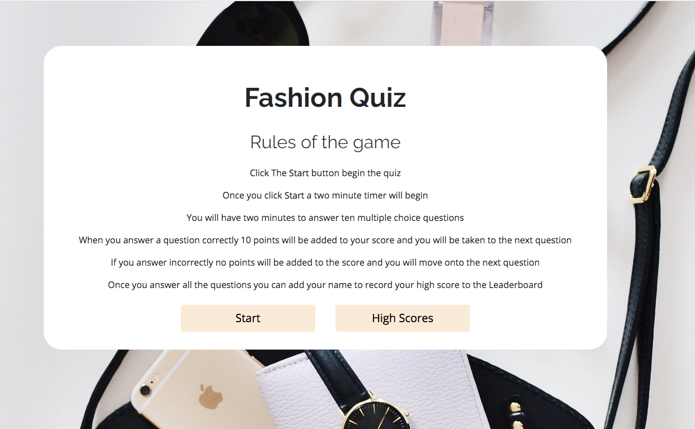
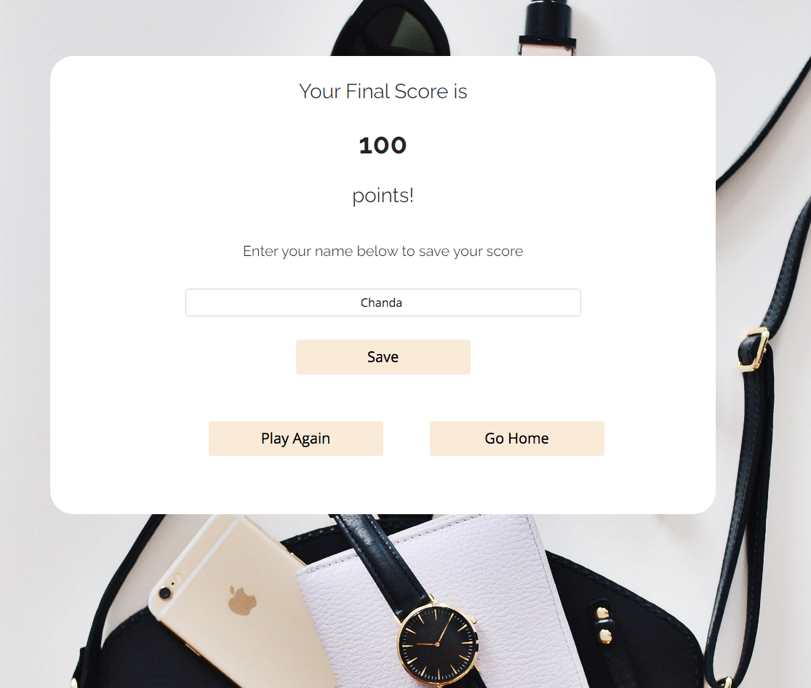
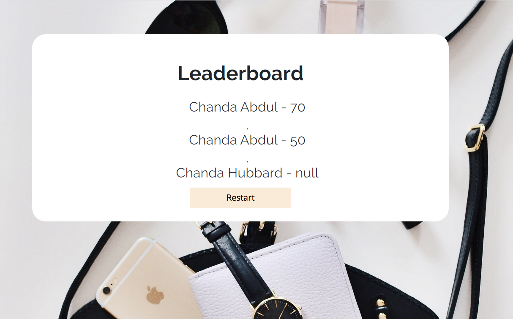

## Programmer
Chanda Abdul
## Your Task
 
You’ll likely be asked to complete a coding assessment;
perhaps as part of an interview process. A typical coding assessment includes
both multiple-choice questions and interactive coding challenges. 
 
Let’s build a timed coding quiz with multiple choice questions. 
This app will run in the browser and will feature dynamically
updated HTML and CSS powered by JavaScript code that you write. 
It will have a clean, polished, and responsive user interface. 
 
## User Story
 
I WANT to take a timed quiz that stores high scores
SO THAT I can gauge my progress compared to my peers

## Acceptance Criteria
 
GIVEN I am taking a code quiz
- [x] WHEN I click the start button
- [x] THEN a timer starts and I am presented with a question
- [x] WHEN I answer a question
- [x] THEN I am presented with another question
- [x] WHEN I answer a question incorrectly
- [x] THEN time is subtracted from the clock
- [x] WHEN all questions are answered or the timer reaches 0
- [x] THEN the game is over
- [x] WHEN the game is over
- [x] THEN I can save my initials and my score
 
## Link

Link to [final project](https://nervous-engelbart-e24713.netlify.app/) & previous version created with [jQuery](https://github.com/Chanda-Abdul/ChandaHubbard.github.io/tree/master/quizapp)

## Screens

### Landing Page

### Question Screen

### Final Score

### Leaderboard
